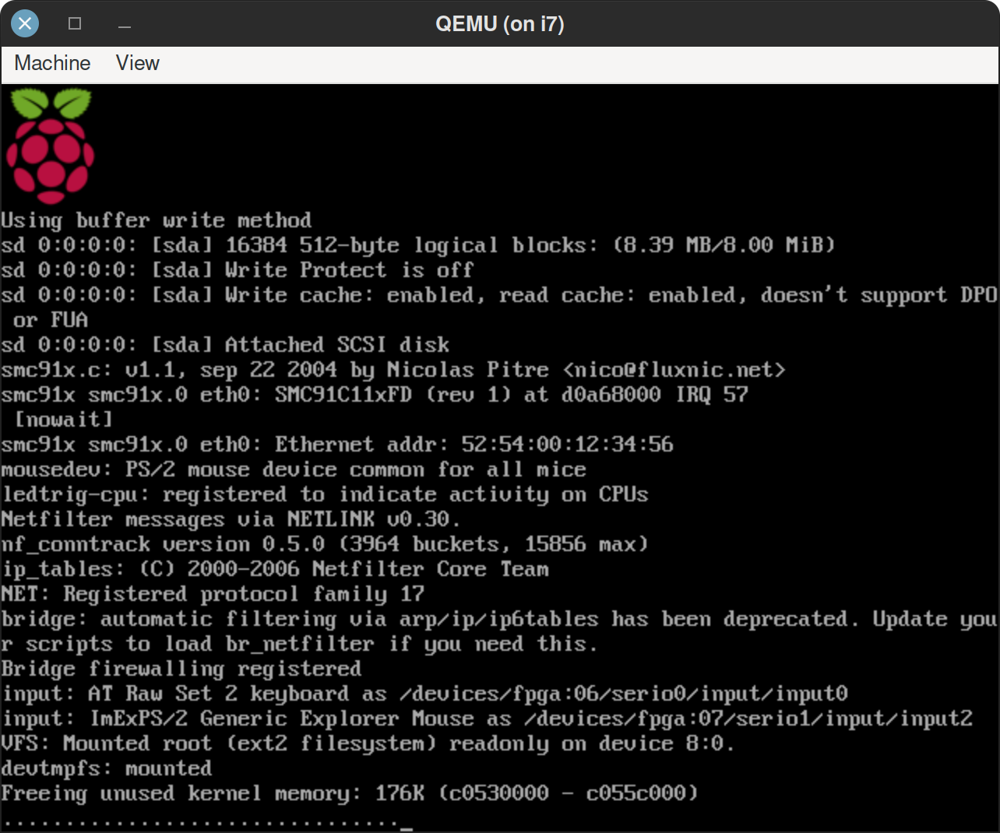

## Booting straight into a custom Raspberry Pi/ARM binary with QEMU.

Running the demo:

    bash doit.sh

If you want to type the commands instead, here's just the commands (see below for a
commented version):

    # See 'doit.sh'
    sudo apt install gcc-arm-linux-gnueabi qemu-system-arm
    mkdir -p boot boot/dev
    arm-linux-gnueabi-gcc -static start.c -o boot/command.com
    dd if=/dev/zero of=rawfs.img bs=1M count=8
    mkfs.ext2 -d boot rawfs.img
    qemu-system-arm rawfs.img -kernel ../kernel-qemu-4.4.34-jessie -cpu arm1176 -m 256 -M versatilepb -serial stdio -append "init=command.com root=/dev/sda rootfstype=ext2 ro" -no-reboot

Screenshot:

Commented version of doit.sh:

    #!/bin/bash

    set -e
    set -x

    # Avoid annoying output from apt if the packages are already
    # present if we had just written:
    # sudo apt install gcc-arm-linux-gnueabi qemu-system-arm
    which qemu-system-arm arm-linux-gnueabi-gcc || { echo "do sudo apt install gcc-arm-linux-gnueabi qemu-system-arm"; exit 1; }

    # create a staging dir: see the '-d' option of 'mkfs.ext2' below.
    mkdir -p boot boot/dev

    # create a static binary that the kernel will start.
    arm-linux-gnueabi-gcc -static start.c -o boot/command.com

    # create a raw ext2 filesystem image in a file like an old-school
    # DOS floppy disk. No partitions. LOL.
    dd if=/dev/zero of=rawfs.img bs=1M count=8

    # -d copies the the directory into the root of the filesystem after creating it.
    mkfs.ext2 -d boot rawfs.img

    [[ -n "$DISPLAY" ]] || echo -e "\n\n\n\n**** No DISPLAY set. The next command may fail. Try ssh -X, VNC?\n\n\n\n"

    # enjoy! note we used /dev/sda without a numeric partition suffix because this
    # is a raw filesystem.
    qemu-system-arm rawfs.img -kernel ../kernel-qemu-4.4.34-jessie -cpu arm1176 -m 256 -M versatilepb -serial stdio -append "init=command.com root=/dev/sda rootfstype=ext2 ro" -no-reboot

    # PRESS Ctrl-Alt-Q from the window to quit qemu.

QEMU note: I'm using QEMU's generic 'versatilepb' ARM machine because it's
sufficient, and I wasn't able to get the emulated Raspberry Pi working. But I
was able to boot a downloaded Raspberry Pi image as is on the 'versatilepb'
target. Since my goal is run this on real hardware and ideally on multiple
boards, using 'versatilepb' here might actually be a good thing.

TODO: Add references.

eof
